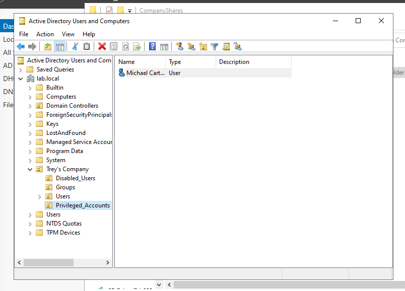
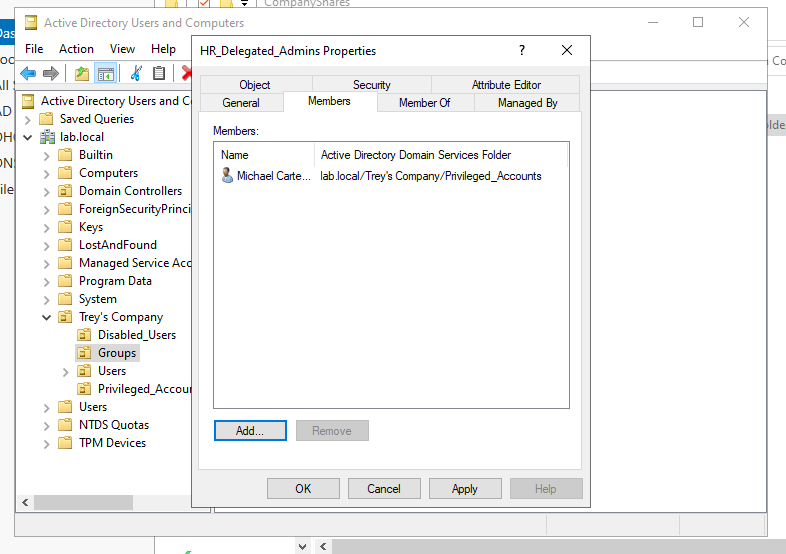
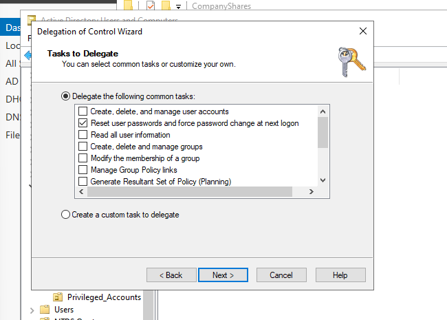

# Phase 4 — Privileged Account Separation & Administrative Least Privilege

## Objective

This phase extends the Active Directory IAM lab by separating a user's standard identity from a dedicated privileged identity and applying scoped administrative delegation instead of broad domain-level administrative access.

The goal was to demonstrate the following model:

```text
Standard Identity: mcarter

Privileged Identity: adm-mcarter
        |
        v
HR_Delegated_Admins
        |
        v
Delegated control over HR OU only
        |
        v
Reset user passwords and force password change at next logon
```

## Privileged Account Separation

A dedicated `Privileged_Accounts` OU was created under `Trey's Company` to separate administrative identities from normal workforce accounts.

Michael Carter was represented by two identities:

- `mcarter` — standard business identity
- `adm-mcarter` — dedicated privileged identity

The privileged account was not added to `Domain Admins`, `Enterprise Admins`, `Administrators`, or `Account Operators`.



## Group-Based Delegated Administration

A Global Security group named `HR_Delegated_Admins` was created. The privileged account `adm-mcarter` was added to this group so administrative permissions could be assigned through group membership rather than directly to an individual account.

```text
adm-mcarter -> HR_Delegated_Admins -> delegated HR administrative permission
```



## Scoped Delegation

Using the Active Directory Delegation of Control Wizard on the HR OU, `HR_Delegated_Admins` was granted only the following common task:

> Reset user passwords and force password change at next logon

The delegation was scoped to:

```text
lab.local/Trey's Company/Users/HR
```

No broad account-management or domain-administration permissions were delegated.



## Authorization Testing

### Positive Test — HR Scope

The delegated credentials for `LAB0\adm-mcarter` were used to reset the password for `sjones`, an account located in the HR OU.

Result: **SUCCESS**


### Negative Test — Outside HR Scope

The same delegated credentials attempted the same password-reset action against `ogarcia`, an account located in the Sales OU.

Result: **ACCESS DENIED**

This demonstrates that the delegated privilege did not extend outside the authorized HR scope.


## Privileged Group Membership Verification

PowerShell verification showed that `adm-mcarter` was a member of only:

- `Domain Users`
- `HR_Delegated_Admins`

The account was not a member of broad administrative groups such as `Domain Admins` or `Enterprise Admins`.


## Security Concepts Demonstrated

- Privileged account separation
- Administrative least privilege
- Group-based permission assignment
- Scoped Active Directory delegation
- Positive and negative authorization testing
- Separation of standard and privileged identities
- Verification that delegated administration does not require Domain Admin membership

## Outcome

This phase demonstrates a practical least-privilege administrative model in Active Directory. A dedicated privileged identity receives a narrowly scoped administrative capability through a security group, succeeds within its authorized HR scope, and is denied when attempting the same action against an account outside that scope.

> **Lab note:** This is an isolated home-lab implementation using fictional identities. Production privileged-access environments should apply organizational password, MFA, privileged access workstation, monitoring, credential rotation, and privileged access management policies as appropriate.
