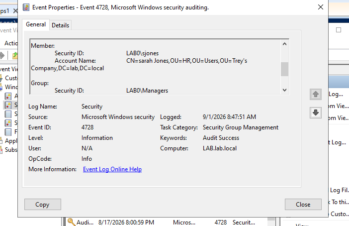
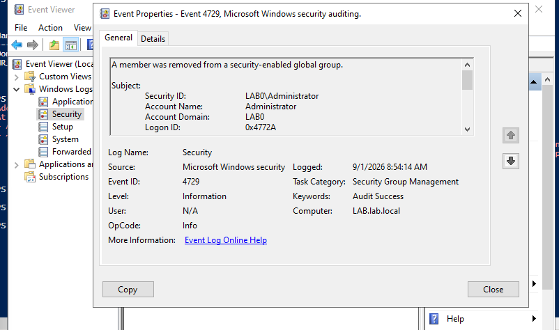
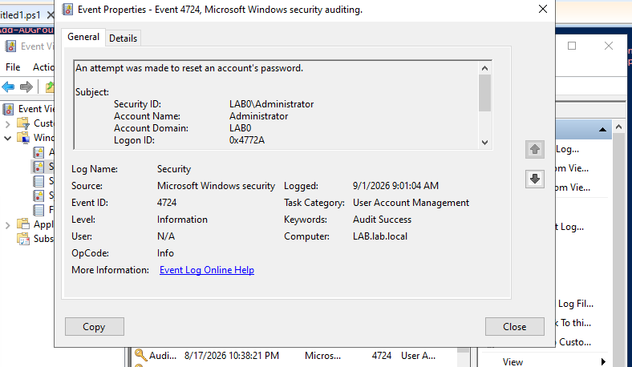
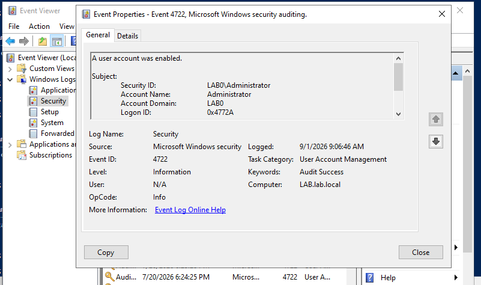
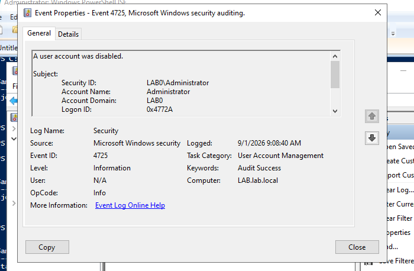
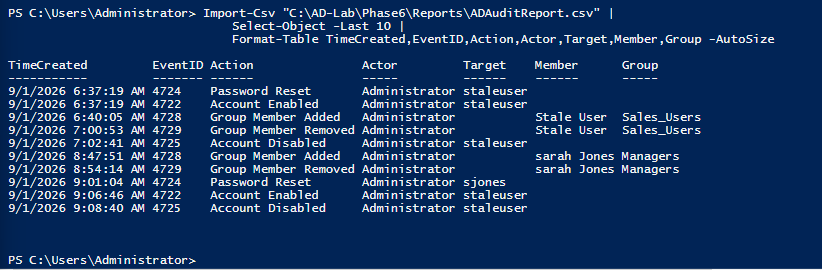

# Phase 6 — Active Directory Auditing & Security Monitoring

## Objective

Build a practical Active Directory auditing workflow that correlates administrative identity actions with Windows Security events and produces a reusable PowerShell audit report.

This phase focuses on identifying **who performed an action, which identity was affected, what access or account state changed, and when the change occurred**.

## Environment

- Windows Server Active Directory Domain Services
- Domain: `lab.local`
- PowerShell ISE
- Windows Event Viewer
- Windows Security log
- Fictional lab identities only

## Security Events Reviewed

| Event ID | Meaning |
| --- | --- |
| `4722` | A user account was enabled |
| `4724` | An attempt was made to reset an account's password |
| `4725` | A user account was disabled |
| `4728` | A member was added to a security-enabled global group |
| `4729` | A member was removed from a security-enabled global group |

## Controlled Audit Scenarios

### Group Membership Change

A controlled access change was performed by temporarily adding the fictional HR user `sjones` to the `Managers` security group.

Windows Security auditing captured:

- **4728** — member added
- Actor: `Administrator`
- Affected identity: Sarah Jones
- Group: `Managers`

The test access was then removed, generating:

- **4729** — member removed
- Actor: `Administrator`
- Affected identity: Sarah Jones
- Group: `Managers`

The account's legitimate group membership was verified after remediation.

### Password Reset

A controlled password reset was performed for the fictional account `sjones`.

Event **4724** recorded the reset attempt and identified:

- Actor: `Administrator`
- Target account: `sjones`

The event timestamp was correlated with the account's `PasswordLastSet` value in Active Directory.

### Account Enable / Disable

The previously disabled Phase 5 test identity `staleuser` was temporarily enabled to generate a controlled lifecycle event.

Windows recorded:

- **4722** — `staleuser` enabled
- **4725** — `staleuser` disabled

After testing, the account was verified as disabled and remained in the `Disabled_Users` OU.

## PowerShell Audit Reporting

`Scripts/ADAuditReport.ps1` queries the Windows Security log for the five IAM-relevant event IDs over a **30-day review window**.

The script:

1. Queries matching Security events with `Get-WinEvent`.
2. Converts each event to XML.
3. Extracts structured `EventData` fields.
4. Maps event IDs to readable IAM actions.
5. Normalizes actor, target, member, and group information.
6. Exports the results to CSV.
7. Displays a short completion summary.

The reporting workflow is **read-only toward Active Directory and the Windows Security log**. It only writes its generated CSV report.

## Sample Audit Timeline

The controlled test sequence demonstrated:

| Event ID | Action | Actor | Affected Identity | Group |
| --- | --- | --- | --- | --- |
| `4728` | Group Member Added | Administrator | Sarah Jones | Managers |
| `4729` | Group Member Removed | Administrator | Sarah Jones | Managers |
| `4724` | Password Reset | Administrator | sjones | |
| `4722` | Account Enabled | Administrator | staleuser | |
| `4725` | Account Disabled | Administrator | staleuser | |

`Reports/ADAuditReport-Sample.csv` contains a sanitized portfolio sample of these controlled events rather than the full local Security-log export.

## Evidence

### Group membership auditing

### Password reset auditing

### Account lifecycle auditing

### PowerShell reporting

## Skills Demonstrated

- Active Directory security auditing
- Windows Security event investigation
- Event Viewer filtering and analysis
- PowerShell `Get-WinEvent`
- Windows Event XML parsing
- Identity lifecycle monitoring
- Privileged action attribution
- Group membership change monitoring
- Password-reset auditing
- Account enable/disable auditing
- CSV audit reporting
- Evidence collection and remediation verification

## Security Note

This is a hands-on home lab. All employee identities and account data shown are fictional. No production credentials, private keys, VM disks, snapshots, ISOs, or real employee information are included.
