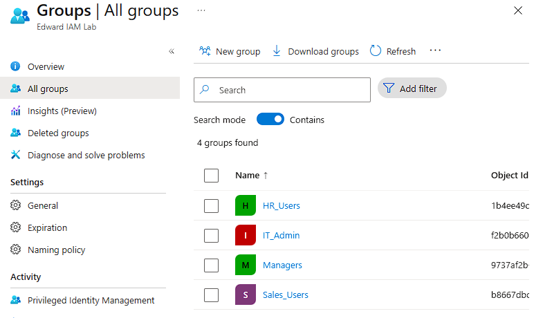
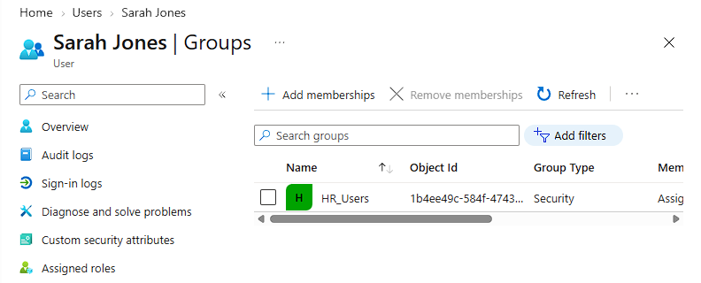
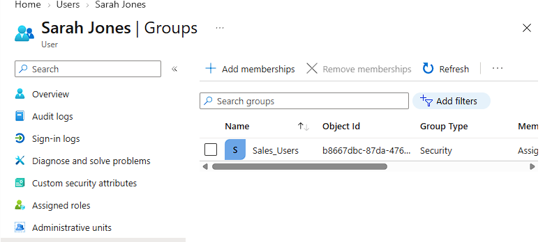
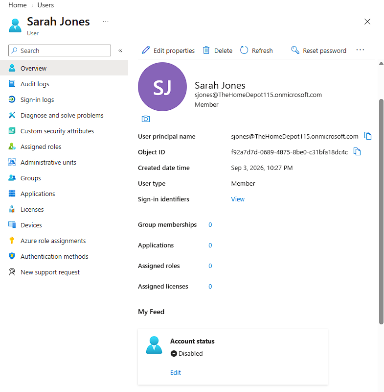
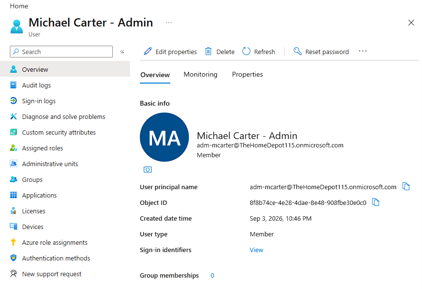
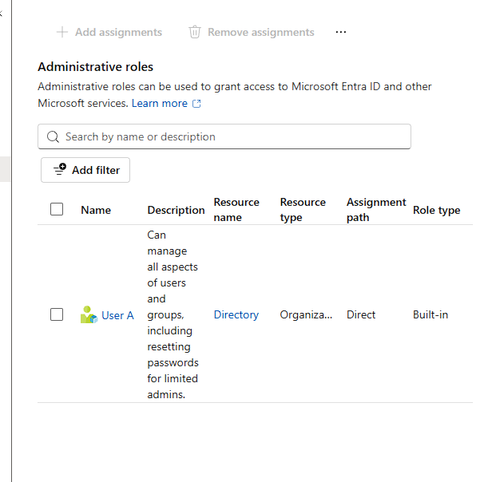
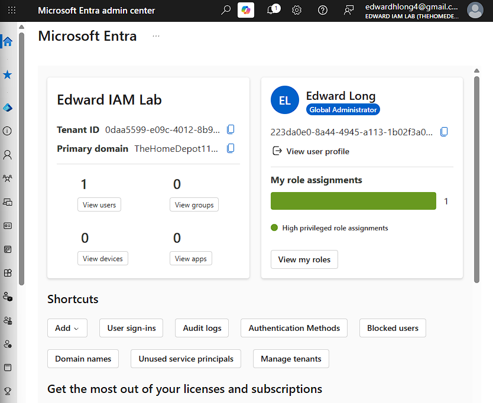

# Phase 7 --- Microsoft Entra ID / Cloud IAM

Phase 7 extends the Active Directory IAM home lab into Microsoft Entra
ID and demonstrates cloud identity lifecycle management, group-based
access, privileged-account separation, least-privilege role delegation,
MFA, and audit verification.

> **Lab scope:** This is a self-directed home lab using fictional
> identities. It is not presented as production enterprise
> administration. The tenant display name was changed to **Edward IAM
> Lab** for clear separation from unrelated naming that existed when the
> tenant was first accessed.

## Objectives

-   Build and organize a Microsoft Entra ID lab tenant
-   Recreate department-based security groups in the cloud
-   Perform a cloud Joiner--Mover--Leaver lifecycle
-   Use group membership to represent role-based access
-   Separate standard and privileged administrative identities
-   Apply a limited built-in Entra administrative role
-   Protect the privileged account with MFA
-   Test delegated administration with a controlled user
-   Verify privileged activity through Entra audit logs
-   Demonstrate a least-privilege permission boundary

## Lab Security Groups

The following Entra security groups were created to mirror the
department/role model used in the on-premises Active Directory lab:

-   `HR_Users`
-   `IT_Admin`
-   `Managers`
-   `Sales_Users`



## Cloud Joiner--Mover--Leaver Workflow

### Joiner

A fictional identity, **Sarah Jones**, was created as an internal Entra
user. Identity attributes were populated for the lab, including HR job
information, and Sarah was assigned to `HR_Users`.



### Mover

Sarah's business role was changed from Human Resources to Sales. Her
profile was updated and her access was changed from `HR_Users` to
`Sales_Users`.



This demonstrates that authorization follows the user's current business
role rather than remaining permanently attached to the original
department.

### Leaver

Sarah's business access was removed and the account was disabled. Final
verification showed zero group memberships and a disabled account state.



## Privileged Account Separation

A separate privileged identity, **Michael Carter - Admin**
(`adm-mcarter`), was created instead of using a standard identity for
administrative work.



The privileged identity was assigned the built-in **User Administrator**
role rather than Global Administrator. The final role review confirmed
that this was Michael's only administrative role.



This applies the same privileged-account-separation and least-privilege
principles practiced earlier in the on-premises AD lab.

## MFA and Delegated Administration

The `adm-mcarter` privileged account completed Microsoft Authenticator
registration during first sign-in. No QR code, password, recovery code,
or authentication secret is included in this repository.

A temporary **Delegated Test User** was then created to validate
Michael's delegated permissions. While signed in as `adm-mcarter`,
Michael successfully performed an allowed password-reset operation
against the standard test identity.

A Global Administrator review of the audit trail showed the successful
action attributed to `adm-mcarter`.


## Least-Privilege Permission Boundary

The delegated User Administrator account could perform the approved
user-administration task, but it could not access the target user's
audit-log page. Entra returned a 401 access-denied result.


The audit evidence was instead reviewed from the Global Administrator
session. This demonstrates a useful separation of duties:

``` text
Global Administrator
        |
        +-- Assigns limited User Administrator role
        |
        v
adm-mcarter (User Administrator)
        |
        +-- Can perform delegated user administration
        |
        +-- Cannot access broader audit data
        |
        v
Global Administrator reviews the audit trail
```

The temporary delegated test identity was deleted after the validation
was complete.

## Tenant Evidence



The lab tenant contains the cloud IAM objects used for this phase while
preserving the original tenant domain assigned by Microsoft.

## Skills Demonstrated

-   Microsoft Entra ID administration
-   Cloud identity lifecycle management
-   Joiner--Mover--Leaver workflows
-   Security-group administration
-   Group-based RBAC concepts
-   User attribute management
-   Account disablement and access removal
-   Privileged-account separation
-   Least-privilege role assignment
-   Microsoft Entra built-in roles
-   User Administrator delegation
-   MFA enrollment for privileged access
-   Delegated password administration
-   Entra audit-log investigation
-   Privileged-action attribution
-   Permission-boundary validation
-   Controlled test-account cleanup

## Security / Portfolio Notes

-   All employee identities used in the lab are fictional.
-   Passwords and temporary passwords are not stored in the repository.
-   MFA QR codes, recovery information, and authentication secrets are
    not published.
-   The lab is documented as hands-on practice rather than production
    experience.
-   Object IDs and tenant identifiers visible incidentally in
    screenshots are not used as authentication credentials; sensitive
    authentication material is excluded.

## Outcome

Phase 7 connected the on-premises IAM concepts from the earlier phases
with Microsoft Entra ID. The completed lab now demonstrates identity
lifecycle automation, RBAC, privileged access separation, identity
governance, security auditing, and cloud IAM administration across a
seven-phase portfolio project.
