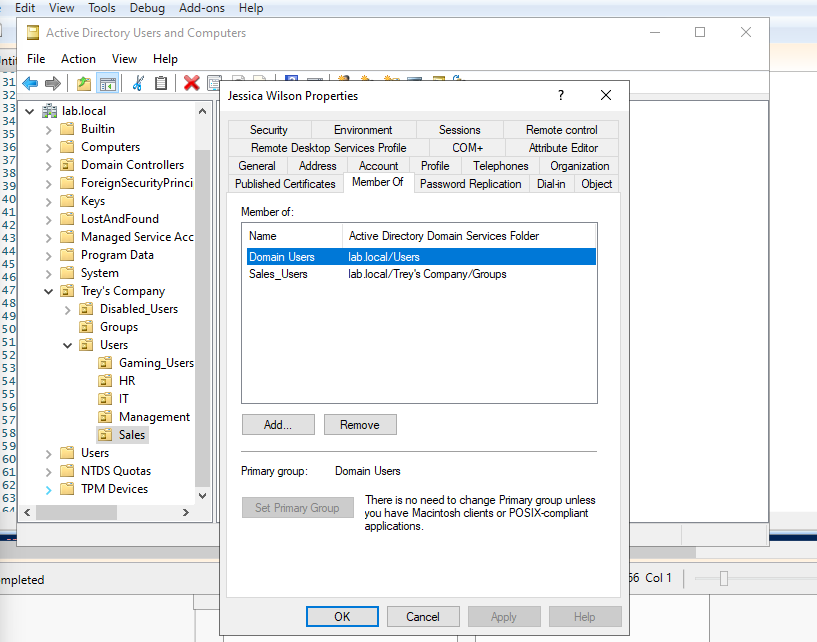

# Active Directory Sysadmin Lab

A hands-on Windows Server / Active Directory home lab built and tested inside a virtual machine to practice core system-administration skills and PowerShell automation.

## Project Overview

This project simulates a small business environment using a virtualized Windows Server lab. Inside the VM, I configured Active Directory Domain Services (AD DS), designed an organizational-unit structure, created department security groups, added fictional employee accounts, configured Group Policy, and built a CSV-driven PowerShell provisioning workflow.

The goal of the project was to move beyond GUI-only Active Directory administration and begin automating repeatable sysadmin tasks with PowerShell.

## Lab Environment

The project was completed in a virtual machine rather than on physical enterprise hardware.

### Virtualized Environment

- Windows Server virtual machine
- Active Directory Domain Services (AD DS)
- Domain: `lab.local`
- Fictional company OU: `Trey's Company`
- Active Directory Users and Computers (ADUC)
- Group Policy Management
- Windows PowerShell / ActiveDirectory module

The VM provided an isolated environment where I could safely create, test, troubleshoot, and automate Active Directory administration without affecting a production network.

> The virtual machine itself is not included in this repository. This repository contains the scripts, sample data, documentation, and screenshots that demonstrate the work completed inside the lab.

## Skills Demonstrated

- Windows Server administration
- Active Directory Domain Services
- Active Directory Users and Computers
- Organizational Unit (OU) design
- User and security-group administration
- Group Policy administration
- PowerShell
- ActiveDirectory PowerShell module
- CSV-driven user provisioning
- Username generation
- Department-to-OU mapping
- Department-to-security-group mapping
- Duplicate-account detection
- Basic PowerShell error handling
- Verification of OU placement and group membership
- Troubleshooting Active Directory and PowerShell issues

## Active Directory Structure

The lab uses the `lab.local` domain with a fictional company OU named `Trey's Company`.

The company structure includes department OUs such as:

- HR
- IT
- Sales
- Management
- Gaming
- Disabled Users

Security groups include:

- `HR_Users`
- `IT_Admin`
- `Sales_Users`
- `Managers`
- `Gaming_Admin`

## Phase 1 — Active Directory Infrastructure

The first phase focused on building and understanding the environment manually inside the Windows Server VM.

Tasks included:

- Installing/configuring Active Directory for the lab
- Creating the company OU structure
- Creating department OUs
- Creating fictional employee accounts
- Creating security groups
- Assigning users to groups
- Creating and applying Group Policy Objects (GPOs)

### AD Structure


This structure became the foundation for the PowerShell automation added in Phase 2.

## Phase 2 — PowerShell User Provisioning

The second phase focused on automating user provisioning instead of manually creating every employee through ADUC.

The script:

`Phase-2-PowerShell-Automation/UserProvisioning.ps1`

reads fictional employee information from:

`NewEmployees-Sample.csv`

### Provisioning Workflow

For each employee in the CSV, the script:

1. Reads the employee's first name, last name, department, and job title.
2. Generates a username using the employee's first initial and last name.
3. Determines the correct Active Directory OU based on department.
4. Determines the correct department security group.
5. Checks Active Directory to see whether the username already exists.
6. Skips existing accounts to prevent duplicate creation.
7. Creates missing AD user accounts.
8. Sets department and job-title attributes.
9. Places the account in the correct OU.
10. Enables the account.
11. Requires a password change at first logon.
12. Adds the account to the appropriate security group.
13. Reports success, skipped accounts, or errors in PowerShell.

### Password Handling

The temporary password is requested at runtime with:

```powershell
Read-Host -AsSecureString
```

The password is not stored directly in the PowerShell script or CSV.

## PowerShell Automation

The provisioning script uses concepts and commands including:

```powershell
Import-Module ActiveDirectory
Import-Csv
Get-ADUser
New-ADUser
Add-ADGroupMember
ForEach-Object
try
catch
```

Department mappings are handled through PowerShell hashtables so that employees can automatically be routed to the appropriate OU and group.

## Automation Results


The provisioning test successfully created missing users and assigned them to their correct department groups.

The script was then run again to verify duplicate handling. Existing accounts were safely skipped rather than recreated.

This demonstrates that the provisioning workflow can be rerun without blindly creating duplicate accounts.

## Verification



After provisioning, I verified the resulting accounts in Active Directory Users and Computers.

For example, the Sales employee shown above:

- Exists in the Sales OU
- Is a member of `Domain Users`
- Is a member of the `Sales_Users` security group

This verifies that the automation performed both account creation and group assignment correctly.

## Repository Structure

```text
Active-Directory-Sysadmin-Lab/
├── README.md
├── .gitignore
├── GITHUB-UPLOAD-CHECKLIST.md
│
├── Phase-1-AD-Infrastructure/
│   └── Screenshots/
│       └── AD-Structure.png
│
└── Phase-2-PowerShell-Automation/
    ├── UserProvisioning.ps1
    ├── NewEmployees-Sample.csv
    └── Screenshots/
        ├── Provisioning-Script-1.png
        ├── Provisioning-Script-2.png
        ├── Provisioning-Results.png
        └── Group-Membership.png
```

## Running the Script

This project was designed for a controlled Active Directory lab environment.

Before running the script in another lab, review and update:

- Domain name
- OU distinguished names
- Security-group names
- CSV path/data
- Password policy requirements

Requirements include:

- Windows Server or an administrative Windows system with the Active Directory PowerShell module
- Network/domain access to Active Directory
- Permissions to create users
- Permissions to modify group membership

## Problems I Troubleshot

Building the project also involved troubleshooting several issues, including:

- Incorrect PowerShell syntax
- Missing parentheses
- CSV header mismatches
- Incorrect Distinguished Names
- Password-policy requirements
- Existing user accounts
- PowerShell session variables
- AD OU path validation
- Security-group mapping
- Script file organization

Working through these problems helped reinforce both PowerShell fundamentals and practical Active Directory troubleshooting.

## What I Learned

This project helped me progress from manually administering Active Directory to using PowerShell for repeatable administrative workflows.

I gained hands-on experience with:

- Building an Active Directory environment in a VM
- Structuring users, departments, and groups
- Querying Active Directory with PowerShell
- Automating account creation
- Handling duplicate accounts
- Mapping business departments to technical access controls
- Testing automation before making changes
- Verifying the results in ADUC
- Troubleshooting failed commands and configuration issues

## Planned Improvements

Future versions of the lab can include:

- Provisioning logs
- Unique temporary-password generation
- Automated employee offboarding
- Moving terminated users to `Disabled_Users`
- Removing group memberships during offboarding
- Inactive-account reporting
- Password-expiration reporting
- Computer inventory
- File-share and NTFS permissions
- Additional Group Policy hardening
- Active Directory security monitoring
- Microsoft Entra ID / hybrid identity expansion

## Security Notes

- All employees in this repository are fictional.
- No real credentials are included.
- No passwords are stored in the script.
- The virtual machine itself is not uploaded.
- VM disks, snapshots, ISO files, and exported appliances should not be committed to GitHub.
- This project is a home lab and should not be treated as production-ready automation without additional validation, security controls, and review.
