# Active Directory Sysadmin & IAM Lab

A Windows Server / Active Directory home lab built to practice system administration, PowerShell automation, and identity lifecycle management.

## Project Overview

This project simulates a small company environment in the `lab.local` Active Directory domain. The lab includes organizational units, department security groups, fictional employee accounts, Group Policy, and PowerShell automation for the Joiner-Mover-Leaver (JML) identity lifecycle.

The goal is to move beyond GUI-only administration and practice repeatable, auditable identity-management workflows while validating changes in Active Directory Users and Computers (ADUC).

## Skills Demonstrated

- Windows Server and Active Directory Domain Services (AD DS)
- Active Directory Users and Computers (ADUC)
- Organizational Unit (OU) design and security groups
- Group Policy administration
- PowerShell and the ActiveDirectory module
- CSV-driven Joiner, Mover, and Leaver automation
- Department-to-OU and department-to-group mapping
- Duplicate and already-disabled account protection
- `try` / `catch` and `-ErrorAction Stop`
- Pre-validation before destructive account changes
- CSV audit logging
- OU, account-status, and group-membership verification

## Phase 1 — Active Directory Infrastructure

I built the Active Directory structure manually to understand the underlying administration before automating it. This included OUs, users, security groups, and Group Policy configuration.

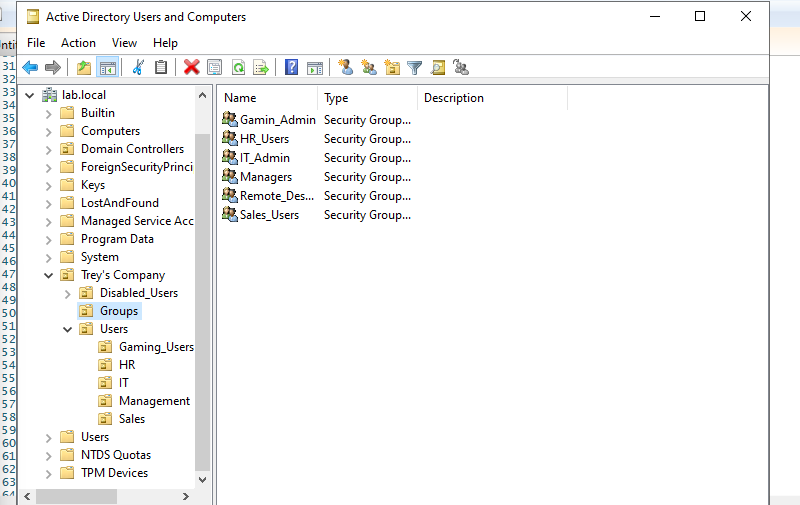

## Phase 2 — IAM Joiner, Mover, and Leaver Automation

### Joiner Workflow

`UserProvisioning.ps1` reads fictional employee records from `NewEmployees-Sample.csv`, generates usernames, maps departments to OUs/groups, checks for duplicates, creates missing accounts, sets attributes, requires password change at first logon, and assigns department security groups. The temporary password is requested at runtime and is not stored in this repository.

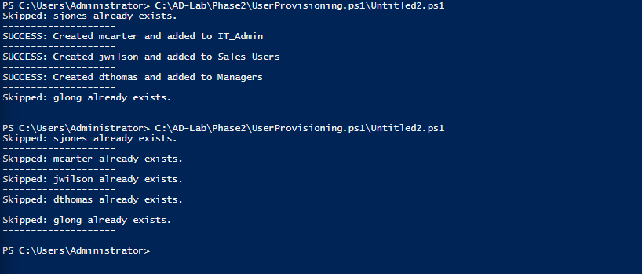

### Mover Workflow

`UserMover.ps1` processes department/job changes from `EmployeeChanges-Sample.csv`. It captures the previous state, validates the requested department, updates AD attributes, removes old department access, adds new department access, moves the account to the correct OU, and records SUCCESS/ERROR results in a CSV audit log.

A clean test moved Michael Carter (`mcarter`) from IT to Sales, including `IT_Admin` → `Sales_Users`, the Sales OU, and the Sales Systems Specialist title.


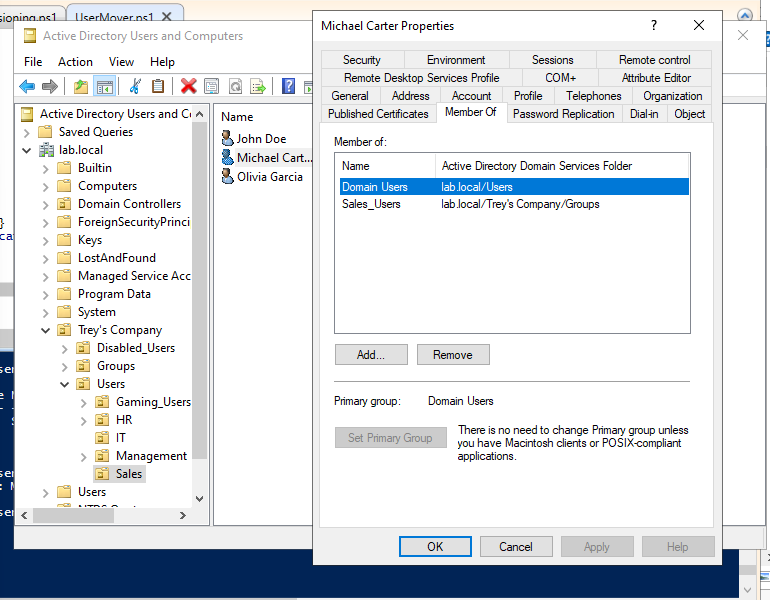

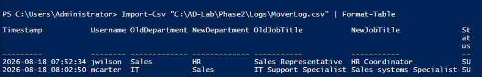

### Leaver Workflow

`UserOffboarding.ps1` verifies the account exists, skips already-disabled users, captures existing access, resolves and validates the `Disabled_Users` OU before making changes, disables the account, removes non-default security groups, retains `Domain Users`, moves the account to `Disabled_Users`, and records SUCCESS/ERROR results.

A clean test offboarded Gavin Long (`glong`). The account was disabled, moved to `Disabled_Users`, and removed from both `IT_Admin` and `Gaming_Admin`. The audit log preserved those previous memberships before removal.


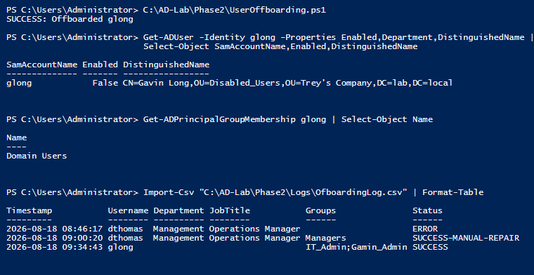

## Troubleshooting and Safety Improvements

Testing exposed realistic failure conditions that were used to harden the workflows:

- A Mover group-name mismatch produced a partial change and led to stronger `try/catch` handling and `-ErrorAction Stop`.
- An early Leaver test disabled an account and removed access before an OU-path problem stopped the final move.
- The failed Leaver attempt was preserved as an ERROR audit record, manually remediated, and separately recorded as `SUCCESS-MANUAL-REPAIR`.
- The Leaver workflow was then improved to validate the destination OU before destructive changes begin.
- A second Leaver test completed cleanly end-to-end with SUCCESS status.

These tests reinforced the importance of validation, audit trails, error handling, and recovery procedures in identity lifecycle management.

## Repository Layout

```text
Active-Directory-IAM-Lab/
├── README.md
├── .gitignore
├── GITHUB-UPLOAD-CHECKLIST.md
├── Phase-1-AD-Infrastructure/
│   └── Screenshots/
│       └── AD-Structure.png
├── Phase-2-PowerShell-Automation/
│   ├── UserProvisioning.ps1
│   ├── UserMover.ps1
│   ├── UserOffboarding.ps1
│   ├── NewEmployees-Sample.csv
│   ├── EmployeeChanges-Sample.csv
│   ├── EmployeeOffboarding-Sample.csv
│   ├── Logs/
│   │   ├── MoverLog-Sample.csv
│   │   └── OffboardingLog-Sample.csv
│   └── Screenshots/
│       ├── Provisioning-Script-1.png
│       ├── Provisioning-Script-2.png
│       ├── Provisioning-Results.png
│       ├── Group-Membership.png
│       ├── Mover-Success.png
│       ├── Mover-Verification.png
│       ├── Mover-Log.png
│       ├── Offboarding-Success.png
│       └── Offboarding-Verification.png
└── Phase-3-RBAC-Least-Privilege/
    ├── README.md
    └── Screenshots/
        ├── HR-NTFS-Permissions.png
        ├── HR-Network-Share.png
        ├── HR-Access-Granted-Modify.png
        ├── HR-Access-Denied.png
        ├── Mover-Sales-to-HR.png
        ├── Mover-HR-Membership-Verification.png
        └── Mover-RBAC-Access-Granted.png
```

## Running the Scripts

These scripts are intended for a controlled Active Directory lab. Review all domain names, OU mappings, group names, CSV paths, and logging paths before running them in another environment.

## Phase 3 — RBAC / Least Privilege

Implemented group-based resource authorization using Active Directory security groups, Windows file sharing, and NTFS permissions.

The authorization model follows:

```text
User -> Department Security Group -> Resource Permission
```

An HR resource was created at `C:\CompanyShares\HR` and shared as `\\Lab\hr`.

- Removed broad `Users` access from the HR folder.
- Assigned `HR_Users` Modify permission at the NTFS level.
- Removed `Everyone` from the share permissions.
- Assigned `HR_Users` Change + Read share permissions.
- Retained administrative and SYSTEM access.
- Verified an HR user could read and create files in the protected resource.
- Verified a non-HR user authenticated successfully but received `Access is denied` when attempting to access the HR resource.

### RBAC Authorization Testing

**HR NTFS permissions assigned through the `HR_Users` security group:**

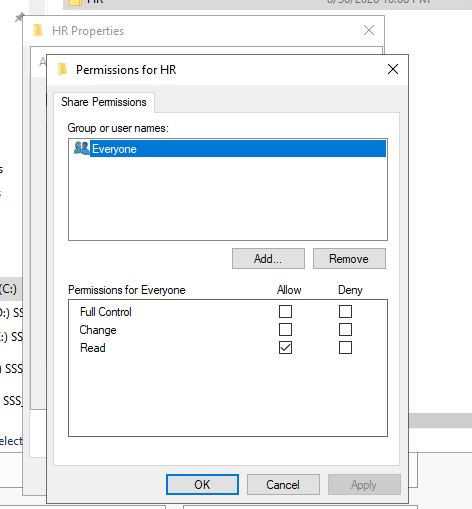

**Unauthorized access test — Sales user authenticated successfully but was denied access to the HR resource:**

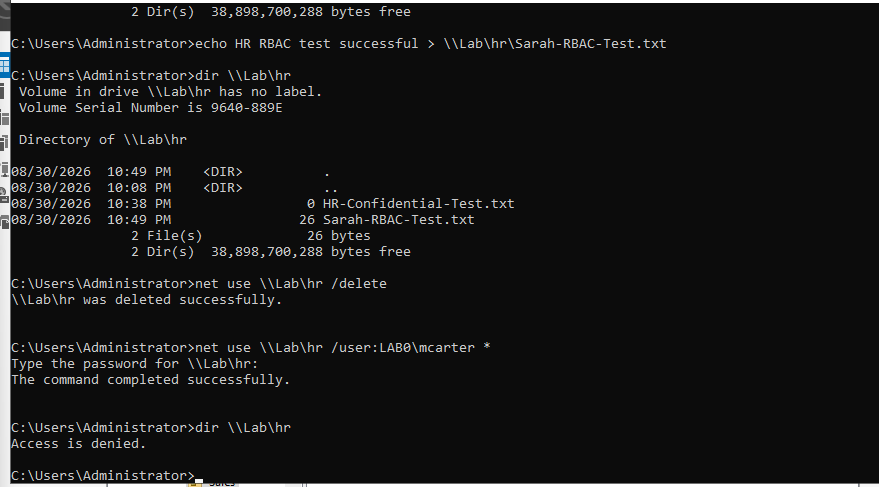

### JML and RBAC Integration

The existing Mover workflow was integrated with the RBAC model to demonstrate how a business-role change affects resource authorization.

Michael Carter (`mcarter`) initially belonged to `Sales_Users` and was denied access to the HR resource. `UserMover.ps1` was then used to transfer the account from Sales to HR.

The workflow:

- Updated the department from Sales to HR.
- Updated the job title to HR Systems Specialist.
- Moved the account from the Sales OU to the HR OU.
- Removed `Sales_Users`.
- Added `HR_Users`.

After the identity change, the same account successfully accessed `\\Lab\hr` without assigning permissions directly to the user.

### Mover-to-RBAC Verification

**Mover verification — Michael's account was transferred to HR and `HR_Users` membership replaced his previous Sales access:**

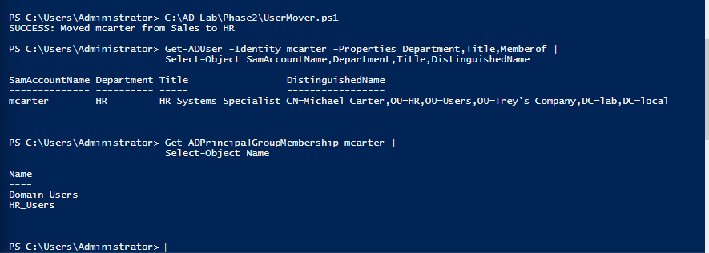

**Access after the role change — the same account successfully accessed the HR resource through its new `HR_Users` membership:**

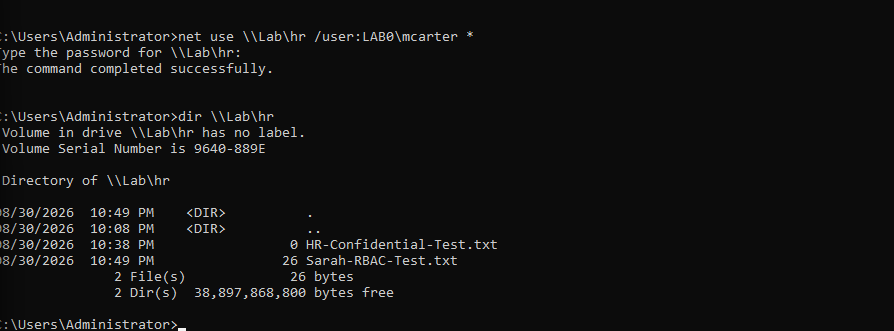

```text
Business Role Change
        ↓
JML Mover Automation
        ↓
AD Security Group Membership
        ↓
RBAC Authorization
        ↓
Resource Access
```
Supporting evidence is documented in `Phase-3-RBAC-Least-Privilege`.

## Phase 4 — Privileged Account Separation / Administrative Least Privilege

Implemented privileged account separation and scoped Active Directory administration to demonstrate least-privilege access for administrative identities.

A dedicated privileged identity was separated from the user's standard business identity:

```text
Standard Identity
mcarter
    |
    +-- Normal business access

Privileged Identity
adm-mcarter
    |
    v
HR_Delegated_Admins
    |
    v
Scoped Delegation on HR OU
    |
    v
Reset User Passwords
```

The privileged account `adm-mcarter` was placed in a dedicated `Privileged_Accounts` OU and assigned to the `HR_Delegated_Admins` security group.

Rather than granting broad privileges such as Domain Admin membership, the Delegation of Control Wizard was used to grant `HR_Delegated_Admins` only the ability to reset user passwords and force password changes within the HR OU.

### Privileged Access Testing

The delegated administrative identity was tested against users both inside and outside its authorized scope.

- HR user `sjones` — password reset succeeded.
- Sales user `ogarcia` — the same password-reset operation returned `Access is denied`.
- `adm-mcarter` group membership was verified as only `Domain Users` and `HR_Delegated_Admins`.
- No Domain Admin, Enterprise Admin, Administrators, or Account Operators membership was assigned.

**Delegated password reset within the authorized HR scope:**

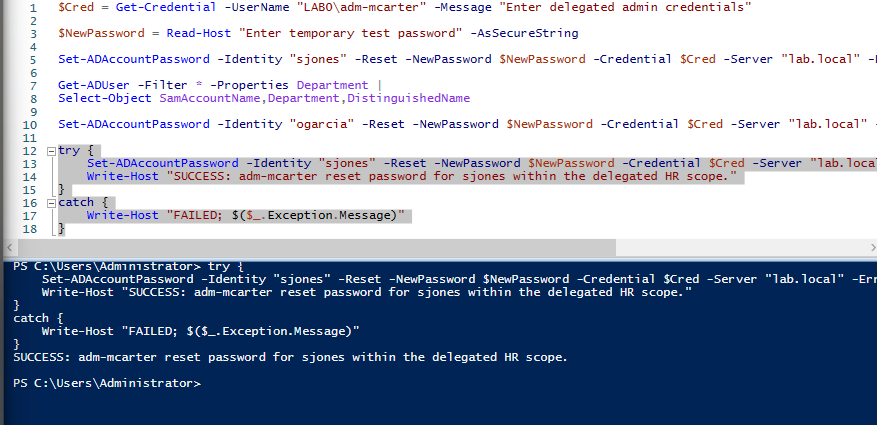

**The same delegated administrator was denied when attempting the operation outside the HR scope:**

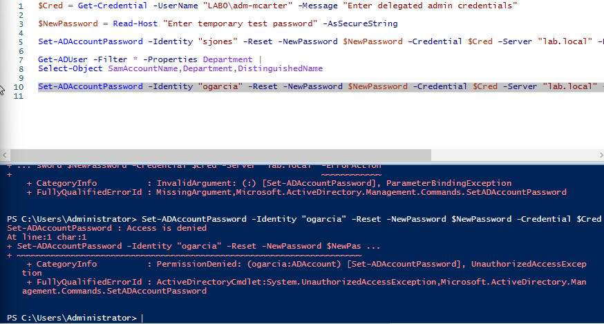

**Privileged account group membership confirms scoped access without broad administrative group membership:**

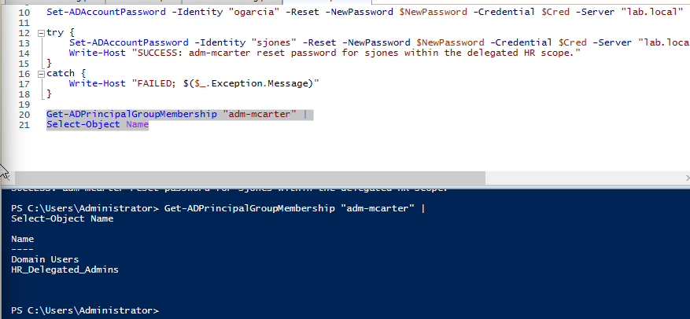

This phase demonstrates:

```text
Privileged Account Separation
        ↓
Security Group-Based Delegation
        ↓
Scoped Administrative Permission
        ↓
Authorized HR Action = SUCCESS
        ↓
Out-of-Scope Sales Action = DENIED
```

Supporting evidence and implementation details are documented in `Phase-4-Privileged-Access`.

# Phase 5 — Identity Governance & Access Reviews

## Objective

This phase extends the Active Directory IAM lab from access control into identity governance. The goal was to identify accounts that require human review, evaluate whether existing access is still justified, remediate unnecessary access, and verify the resulting state.

The phase follows a review-first model:

```text
Identity inventory
      |
      v
Inactivity / access review criteria
      |
      v
Human review decision
      |
      v
Targeted remediation
      |
      v
Post-remediation verification
```

## Identity Access Review

A PowerShell review workflow was built to inspect enabled Active Directory accounts, activity-related attributes, and group memberships. The review logic classifies accounts with role-based group access as `REVIEW` while identities with only the default `Domain Users` membership are treated as `LOW ACCESS` for the lab scenario.

The review does not automatically remove access. A `REVIEW` result indicates that the identity requires human validation before any change is made.

The reusable reporting script is included as [`IdentityAccessReview.ps1`](Phase-5-Identity-Governance/IdentityAccessReview.ps1).

## Access Review Finding

The account `elong` was selected as the controlled access-review case. During investigation, the identity was enabled but had no populated department or title and retained both HR and Management group memberships:

```text
Domain Users
HR_Users
Managers
```

This combination was treated as a lab governance finding because the assigned access could not be justified by the identity attributes being reviewed.


## Access Remediation

The review decision was to remove the unnecessary `HR_Users` and `Managers` memberships while preserving the default `Domain Users` membership.

After remediation, verification showed:

```text
Domain Users
```

The refreshed access-review logic then classified `elong` as `LOW ACCESS`.

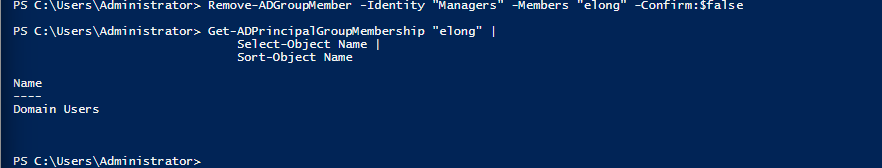

Sample before- and after-remediation CSV evidence is included in:

- [`AccessReview-Sample.csv`](Phase-5-Identity-Governance/AccessReview-Sample.csv)
- [`AccessReview-PostRemediation-Sample.csv`](Phase-5-Identity-Governance/AccessReview-PostRemediation-Sample.csv)

## Inactive Account Review Policy

A 60-day inactivity threshold was defined for the lab. The logic was refined to avoid treating newly created accounts with no logon history as automatically stale.

An enabled account is considered a review candidate when either:

```text
A recorded LastLogonDate is older than 60 days
```

or:

```text
LastLogonDate is blank AND the account itself is older than 60 days
```

A review result is not an automatic disable action. It requires investigation and a documented remediation decision.

## Simulated Stale-Account Scenario

Because the home lab did not naturally contain an enabled identity with more than 60 days of inactivity, a dedicated fictional account named `staleuser` was created for a controlled simulation.

The simulation did **not** change the server clock or falsify Active Directory timestamps. Instead, PowerShell evaluated the account as though the review were occurring 61 days later.

The test account represented a Sales identity with:

```text
Department: Sales
OU: Sales
Groups: Domain Users, Sales_Users
Enabled: True
LastLogonDate: blank
```

The governance logic returned:

```text
REVIEW: staleuser meets the simulated 60-day inactivity threshold.
```

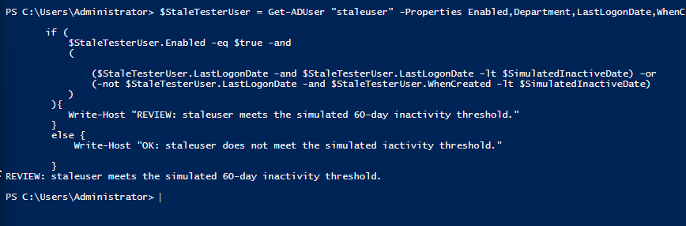

## Stale-Account Remediation

The simulated review decision was that the identity no longer required access. Remediation was performed in controlled stages:

1. Remove `Sales_Users` membership.
2. Verify that only `Domain Users` remained.
3. Disable the account.
4. Move the account to the `Disabled_Users` OU.
5. Verify account status, OU location, and group membership.

Before remediation, the account was enabled in the Sales OU and retained Sales access.

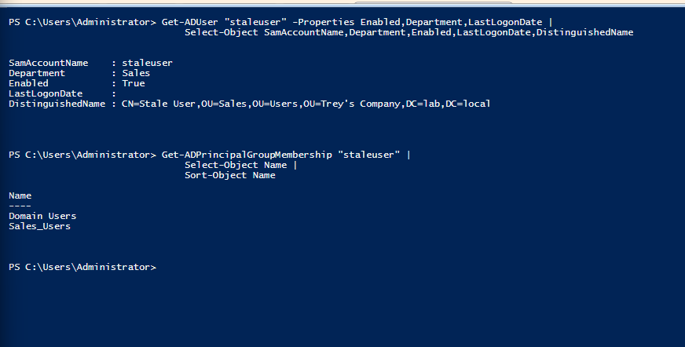

Final verification showed:

```text
Enabled: False
OU: Disabled_Users
Groups: Domain Users only
```

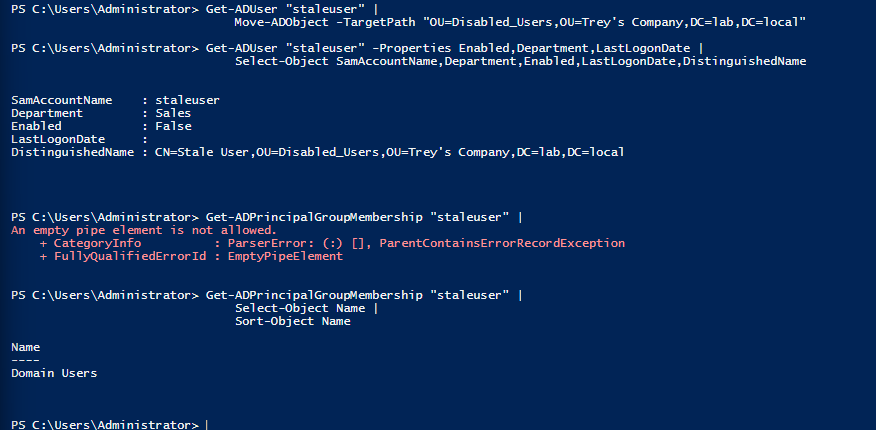

## Reusable Governance Reporting Script

The final PowerShell script performs a read-only Active Directory review and exports the current findings to:

```text
C:\AD-Lab\Phase5\IdentityAccessReview.csv
```

The portfolio copy also creates a header-only CSV when no current findings exist, so a clean post-remediation scan still produces a usable report artifact.


## Security Concepts Demonstrated

- Identity governance
- Periodic access review
- Inactive/stale-account identification
- Review-before-remediation workflow
- Group-membership analysis
- Least-privilege remediation
- Disabled-account containment
- Before/after evidence collection
- PowerShell reporting and CSV export
- Separation of detection from enforcement

## Outcome

This phase demonstrates a practical identity-governance workflow rather than automatic access revocation. Active Directory identities are evaluated using activity and authorization data, suspicious access is reviewed before changes are made, remediation is targeted and verified, and the final state is documented through reusable PowerShell reporting and before/after evidence.

> **Lab note:** All identities and data are fictional and used only in an isolated home lab. The stale-account case is explicitly documented as a simulation. Production identity-governance programs should use approved inactivity thresholds, authoritative HR or identity sources, exception handling, ownership/attestation workflows, change controls, and centralized audit logging.

## Phase 6 — AD Auditing & Security Monitoring

Phase 6 extends the IAM lab into security monitoring and audit evidence collection by using Windows Security logs and PowerShell to track identity-related administrative activity.

### Objectives

- Monitor IAM-relevant Active Directory security events
- Identify the actor responsible for administrative changes
- Track affected users, group memberships, and account states
- Parse Windows Security event XML with PowerShell
- Normalize audit data into readable fields
- Generate a reusable 30-day audit report
- Export audit evidence to CSV

### Security Events Monitored

| Event ID | Activity |
| --- | --- |
| 4722 | User account enabled |
| 4724 | Password reset attempt |
| 4725 | User account disabled |
| 4728 | Member added to a security-enabled global group |
| 4729 | Member removed from a security-enabled global group |

Controlled tests were performed using fictional lab identities to generate and investigate each event type.

PowerShell `Get-WinEvent` was used to retrieve the events from the Windows Security log. Event XML was then parsed to extract and normalize fields including the administrative actor, affected account, group member, and security group.

The final `ADAuditReport.ps1` script reviews the previous 30 days of relevant Security events and exports the normalized results to CSV. The final lab run reviewed 59 matching events.

### Audit Evidence

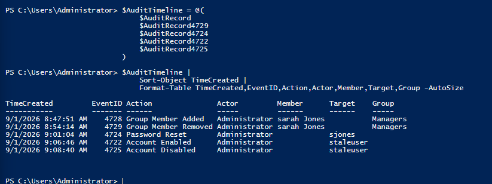

The normalized audit timeline correlates account-management and group-membership events with the administrative actor and affected identity.


The completed reporting workflow generates a CSV audit trail and provides the number of reviewed events and the configured 30-day review window.

### Skills Demonstrated

- Active Directory security auditing
- Windows Security event investigation
- Event Viewer analysis
- PowerShell `Get-WinEvent`
- Windows event XML parsing
- Group membership change monitoring
- Account lifecycle monitoring
- Password-reset auditing
- Privileged action attribution
- Audit trail generation
- CSV security reporting
- Evidence collection and verification

[View the complete Phase 6 documentation](Phase-6-AD-Auditing-Security-Monitoring/README.md)

---

## Next Phase — Microsoft Entra ID / Hybrid Cloud IAM

Phase 7 will extend the identity lab into Microsoft Entra ID and cloud identity administration, with the exact implementation based on the Microsoft environment available for the lab.


## Security Note

All employee data in this repository is fictional. No passwords or credentials are stored in the project. Do not upload VM disks, snapshots, ISOs, exported appliances, private keys, or real employee information.
